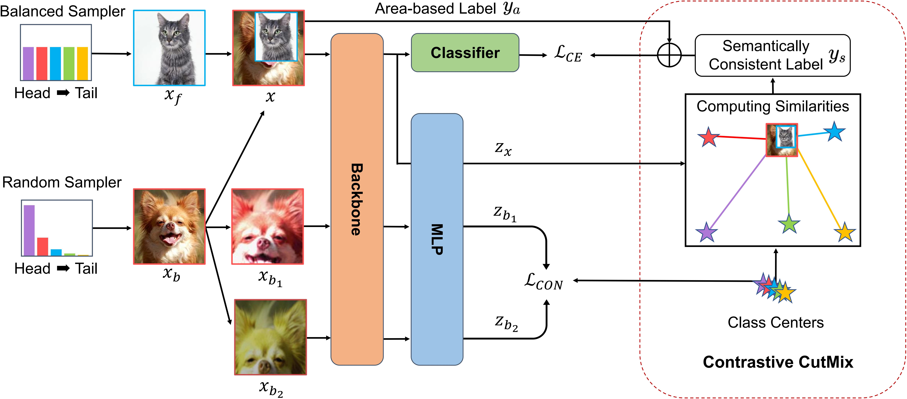

# Contrastive CutMix Augmentation for Long-Tailed Recognition
The key code of our work "Contrastive CutMix Augmentation for Long-Tailed Recognition".

## Results
### CIFAR-LT 

|   Dataset    | Epoch | Imbalance Factor |Top-1 Acc.|             Log             |
|:------------:|:-----:|:----------------:|:-----:|:---------------------------:|
| CIFAR-100-LT |  200  |       100        |   53.16    | [read](\log\cifar100_100.log) |
| CIFAR-100-LT |  200  |        50        |   57.40    | [read](\log\cifar100_50.log) |
| CIFAR-100-LT |  200  |        10        |   64.53    | [read](\log\cifar100_10.log) |
| CIFAR-10-LT  |  200  |       100        |   86.07    | [read](\log\cifar10_100.log) |
| CIFAR-10-LT  |  200  |        50        |   88.00    | [read](\log\cifar10_50.log) |
| CIFAR-10-LT  |  200  |        10        |   91.42    | [read](\log\cifar10_10.log) |
| CIFAR-100-LT |  400  |       100        |   55.06    | [read](\log\cifar100_400.log) |

### ImageNet-LT 
| Dataset  |   Model    | Epoch | Top-1 Acc. |                  Log                  |
|:--------:|:----------:|:-----:|:----------:|:-------------------------------------:|
| ImageNet-LT | ResNet-50  |  100  |   58.49    | [read](\log\imagenet_resnet_100.log)  |
|  ImageNet-LT  | ResNeXt-50 |  90   |   59.76    | [read](\log\imagenet_resnext_90.log)  |
| ImageNet-LT  | ResNeXt-50 |  180  |   60.37    | [read](\log\imagenet_resnext_180.log) |

[//]: # (|  iNaturalist 2018  | ResNet-50  |  100  |   72.06    |                  --                   |)

## Get Start
### 1. Dataset
CIFAR-10 and CIFAR-100 can be automatically downloaded by torchvision.
Details of other datasets can be found in our paper.
### 2.Train
Before you start traning the model, you would better to notice this parameter:\
`--data you_dataset_path`\
`--device_id Multi-GPU_ID` or  `--gpu GPU_ID` 
### 3.Test
Before you start testing the model, you should set:\
`--resume you_model.path.tar`\
`--reload True`
### 4. Run
We provide the implementation and the bash file on the path `./run_files`. 
You can easily run the code just like this:\
#### CIFAR-LT for 200epochs
`bash cifar10_imb10.sh`\
`bash cifar10_imb50.sh`\
`bash cifar10_imb100.sh`\
`bash cifar100_imb10.sh`\
`bash cifar100_imb50.sh`
#### CIFAR-100-LT for 400epochs
`bash cifar100_imb100_400.sh`
#### ImageNet-LT
`bash imagenet_resnet_100.sh`\
`bash imagenet_resnext_90.sh`\
`bash imagenet_resnext_180.sh`
#### iNaturalist 2018
`bash inaturalist_resnet_100.sh`
> If you need to modify the hyperparameters, please refer to the contents of the main program file [_main.py_](main.py) and the [bash file](run_files).
### 5. Reproducing the Experiment 
Furthermore, we run our bash file on CIFAR-100-LT and CIFAR-10-LT at 100 imbalance factor for 200 epochs, and  provide two log files from running this code twice `run1.log` and `run2.log`. The results are shown in the following table:

|        Runs         | Dataset    | Top-1 Acc. |
|:-------------------:|------------|:----------:|
| [1](./log/run1.log) | CIFAR-100-LT |   53.15%   |
| [2](./log/run2.log) | CIFAR-10-LT|   85.94%   |

These results are nearly the same as our reported top-1 accuracy on CIFAR-100-LT of **53.16%** and CIFAR-10-LT of **86.07%**.
